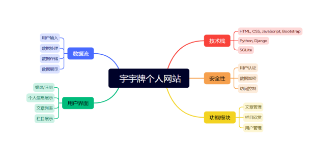
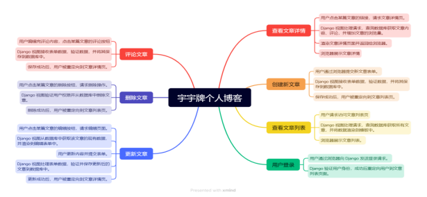
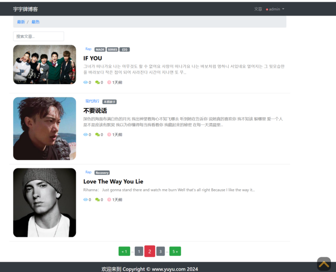
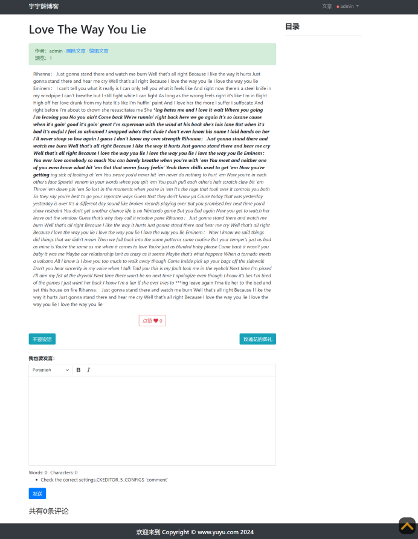
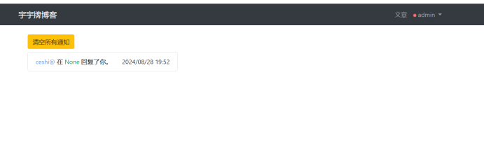
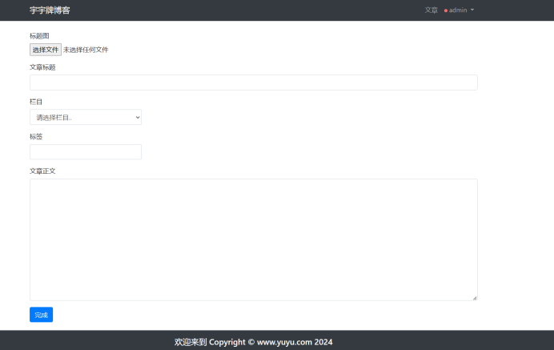
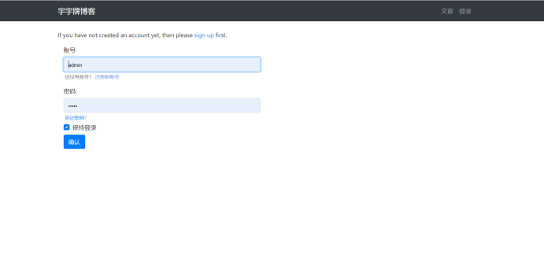

# my_blog
使用django写一个个人博客网站

## 技术选型
Django: 一个高级的Python Web框架，用于快速开发安全且易于维护的网站。  
django-ckeditor-5: 集成CKEditor 5，提供富文本编辑功能。  
django-allauth: 简化用户认证流程，支持多种认证方式。  
djangorestframework: 用于构建RESTful API，方便前后端分离开发。  
Bootstrap: 用于构建响应式和移动优先的 Web 项目。  
jQuery：简化了 HTML 文档遍历、事件处理、动画和 Ajax 交互等常见任务。

## 功能需求分析

## 功能流程图

## 页面展示

## 环境安装
### python版本要求3.8以上
### 构建虚拟环境
### pip install -r requirements.txt
