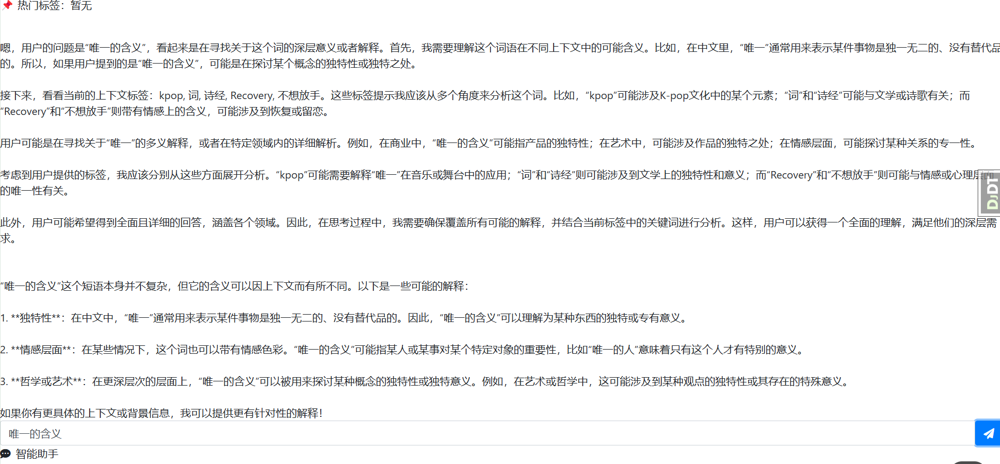
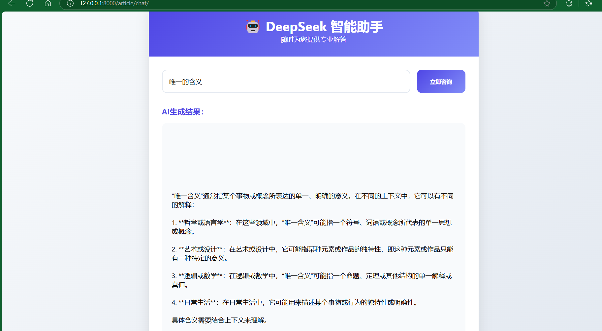
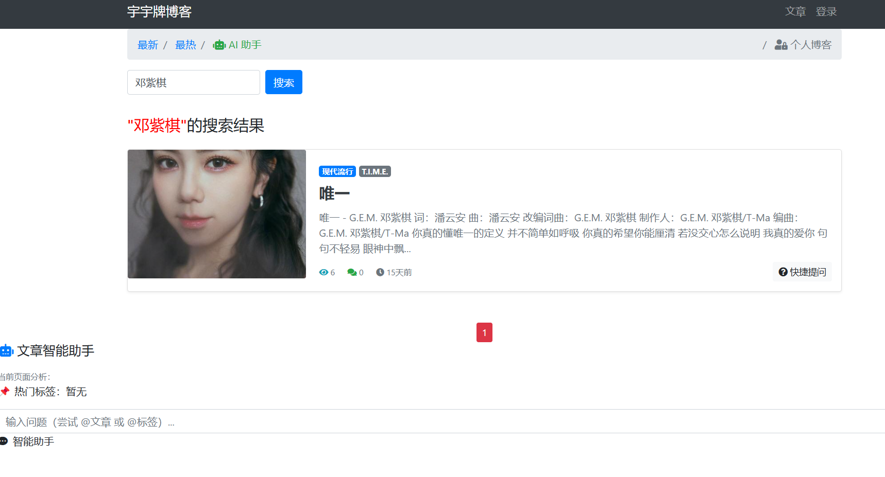

# 我的个人博客网站 V2.0 (My Personal Blog)

基于 **Django** 开发的个人博客网站，支持 AI 助手、搜索历史记录、文章管理等功能。

## 📢 本次更新
- **✨ AI 助手集成**：通过 Ollama 接入 deepseek-r1 大模型，实现智能对话功能。
- **🐛 Bug 修复**：优化性能，修复已知问题。

## 🚀 技术选型 (Technologies Used)
- **Django**：Python Web 框架，快速开发安全且易维护的网站。
- **django-ckeditor-5**：集成 CKEditor 5，提供富文本编辑功能。
- **django-allauth**：支持多种用户认证方式，简化登录注册流程。
- **djangorestframework (DRF)**：用于构建 RESTful API，实现前后端分离。
- **Redis**：高性能键值存储，用于缓存和会话管理。
- **Bootstrap**：响应式 UI 框架，适配移动端设备。
- **jQuery**：简化 AJAX 交互，提高用户体验。

## 📌 功能需求分析 (Functional Requirements Analysis)


## 🔄 功能流程图 (Functional Flowchart)


## 🎨 页面展示 (Page Displays)
- **首页**  
  
- **AI 助手**  
  
- **DeepSeek 助手**  
  
- **搜索历史**  
  
- **文章详情页**  
  
- **个人博客管理**  
  
- **回复通知**  
  
- **添加文章**  
  
- **用户登录**  
  

## 🛠️ 环境安装 (Environment Setup)

### ✅ Windows 上安装 (Windows Setup)
1. **Python 版本要求**：`>= 3.9`
2. **创建虚拟环境**：
   ```bash
   python -m venv venv
   source venv/bin/activate  # macOS/Linux
   venv\Scripts\activate  # Windows
   ```
3. **安装依赖**：
   ```bash
   pip install -r requirements.txt
   ```

### ✅ Linux (CentOS 7) 使用 Docker 部署 (Linux - CentOS 7 with Docker)
1. **安装 Docker** (如果未安装)：
   ```bash
   sudo yum install -y docker
   sudo systemctl start docker
   ```
2. **导航到项目根目录**：
   ```bash
   cd my_blog
   ```
3. **利用 compose.yml 构建 Docker 镜像**：
   ```bash
   docker compose up -d
   ```
4. **查看构建好 Docker 容器**：
   ```bash
   docker ps
   ```
5. **访问博客**：  
   在本地浏览器中打开 [http://localhost:8080](http://localhost:8080)  
   在远程的浏览器打开  [http://hostname:8080](http://hostname:8080)
---

🎯 **欢迎 Star & Fork！** 💡
如果你喜欢这个项目，欢迎在 GitHub 上 **Star** ⭐，并提交你的 PR！
