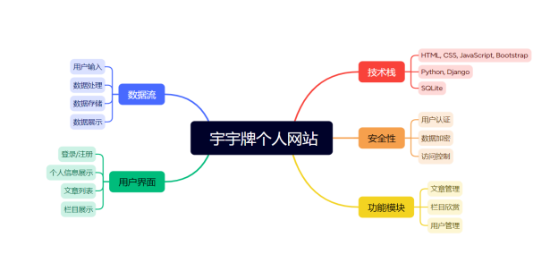
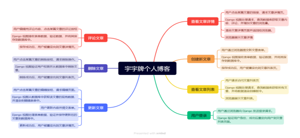
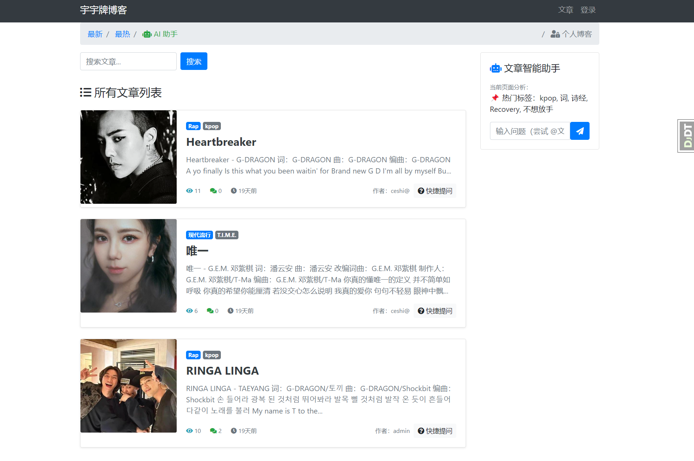
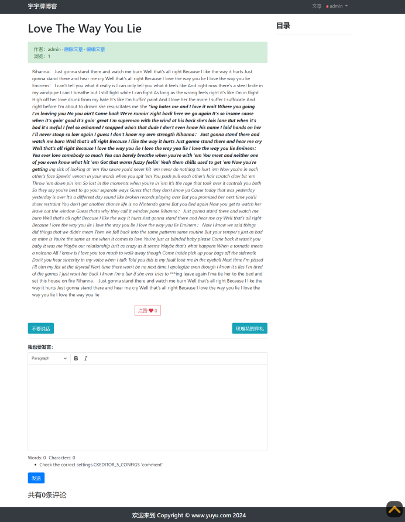
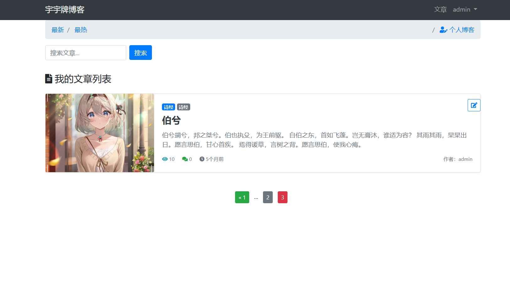
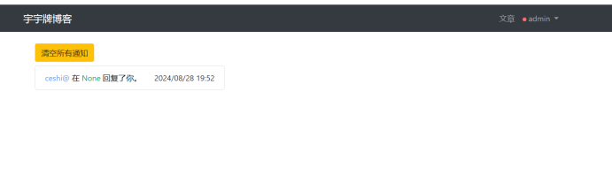
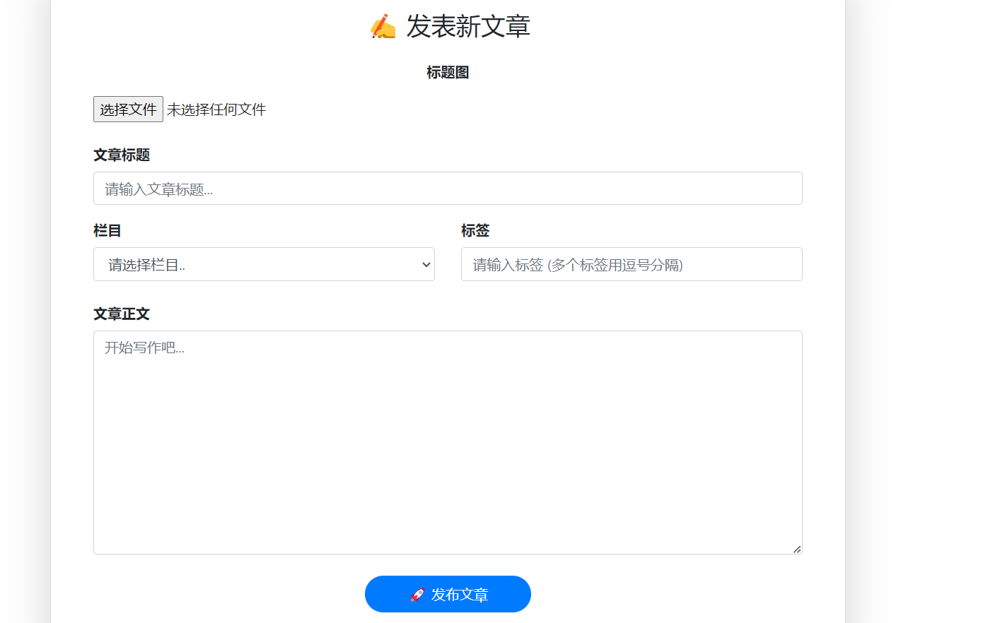
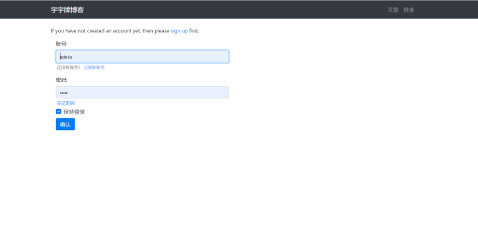

# my_blog
使用django写一个个人博客网站

## 技术选型
Django: 一个高级的Python Web框架，用于快速开发安全且易于维护的网站。  
django-ckeditor-5: 集成CKEditor 5，提供富文本编辑功能。  
django-allauth: 简化用户认证流程，支持多种认证方式。  
djangorestframework: 用于构建RESTful API，方便前后端分离开发。  
Bootstrap: 用于构建响应式和移动优先的 Web 项目。  
jQuery：简化了 HTML 文档遍历、事件处理、动画和 Ajax 交互等常见任务。

## 功能需求分析

## 功能流程图

## 页面展示

## 环境安装
### 第一种方式，Windows上
#### 1.python版本要求3.9以上
#### 2.构建虚拟环境
#### 3.pip install -r requirements.txt

### 第二种方式，linux系统（centos7）
#### 1.先安装docker
#### 2.来到项目根目录
#### 3.输入docker build -t django_blog .
#### 4.构建完镜像后，docker run -id --name=blog -d -v .:/soft -p 8080:8080 django_blog:latest
#### 5.即可登录网站，如果ip有限制，可以在settings.py里添加你的Linux系统的ip
