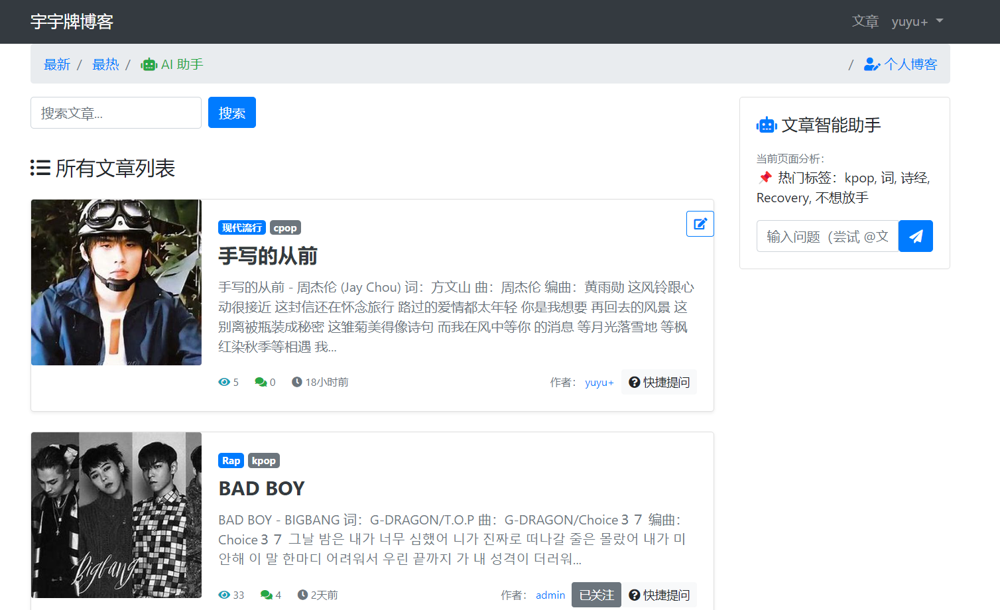

# 我的个人博客网站 (My Personal Blog)

使用Django构建的个人博客网站项目。

## 技术选型 (Technologies Used)
- **Django**: 一个高级的Python Web框架，用于快速开发安全且易于维护的网站。
- **django-ckeditor-5**: 集成CKEditor 5，提供富文本编辑功能。
- **django-allauth**: 简化用户认证流程，支持多种认证方式。
- **djangorestframework**: 用于构建RESTful API，方便前后端分离开发。
- **Redis**: 一个开源的高性能键值对存储系统，用于缓存和会话存储。
- **Bootstrap**: 用于构建响应式和移动优先的Web项目。
- **jQuery**: 简化了HTML文档遍历、事件处理、动画和Ajax交互等常见任务。

## 功能需求分析 (Functional Requirements Analysis)


## 功能流程图 (Functional Flowchart)


## 页面展示 (Page Displays)
- **首页** 
- **搜索历史** 
- **详情页** 
- **个人发布的博客页面** 
- **回复通知** 
- **添加文章** 
- **登录页面** 

## 环境安装 (Environment Setup)

### 第一种方式，Windows上 (Windows)
1. **Python版本要求**：3.9以上
2. **构建虚拟环境**：创建并激活虚拟环境
3. **安装依赖**：`pip install -r requirements.txt`

### 第二种方式，Linux系统（CentOS 7） (Linux - CentOS 7)
1. **安装Docker**：确保Docker已安装
2. **项目根目录**：导航到项目根目录
3. **构建Docker镜像**：`docker build -t my_django_app .`
4. **运行Docker容器**：
   ```bash
   docker run -id --name=django_blog -d -v $(pwd):/soft -p 8080:8080 -p 6379:6379 my_django_app:latest